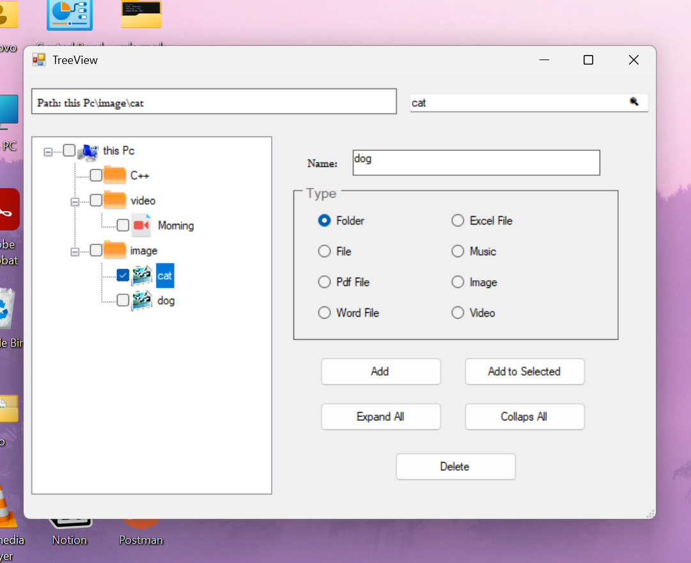

# 📁 My Mini File Explorer (C# WinForms)

Hey there! 👋  
This is a fun side project I built while learning **C#**.

---

## 💡 File Explorer Module Highlights

The File Explorer form simulates hierarchical directory management, combining C# control events with recursive data structure handling:

- **Dynamic Node & Type Management:** Add custom folders, files, and media types with assigned image keys.
- **Recursive Search & Path Expansion:** Traverses nested node structures and automatically expands the path using `EnsureVisible()` to bring searched items into focus.
- **Safe Cascading Deletion:** Implements reverse array/collection iteration (`for` loops counting down) to delete multiple checked nodes safely without collection modification exceptions.
- **Root Protection:** Business logic that protects root-level directories.

## 📸 Preview

---

## 🛠️ How to run it

This repository contains multiple forms and learning modules. To test the **File Explorer & TreeView**:

1. Build and run the project in **Visual Studio** (`F5`).
2. On the main window, click the **`TreeView`** button to launch the full File Explorer interface.
